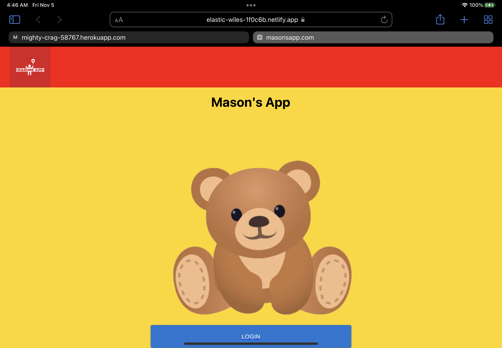
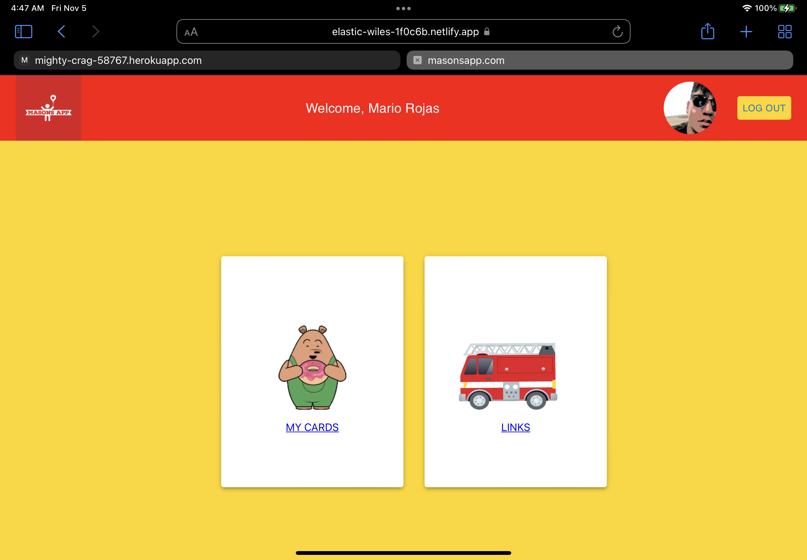
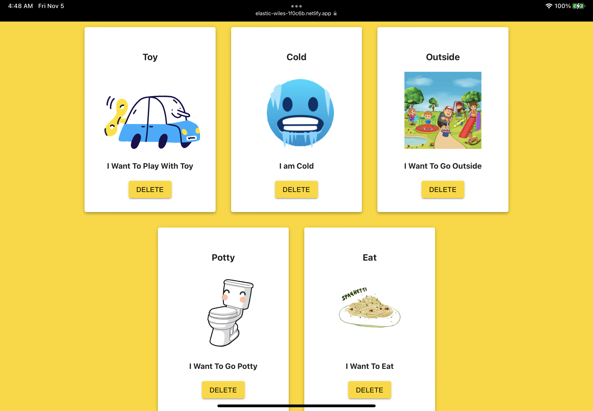

# Mason's App
This app was created with the possabilty in helping kids with disabilities use the pecs method for better communication.
Will be a free open platform for everyone to use world wide.

### [Click here for the live app!](https://elastic-wiles-1f0c6b.netlify.app/)
# Technologies Used
- Node.js
- Express
- MongoDB
- Mongoose
- React
- JavaScript
- HTML
- CSS
- Material UI
- Google Fonts
- Authentication with Google FireBase

# Screenshot(s)

# Getting Started 
Make sure Dependacies are installed.
Sign up as a user and then log in.
Dashboard will be the central hub that you will be able to access everything from. Enjoy the app!

# Future Enhancements
- Picture && Sound Uploads
- Better Device compatibility with all devices
- In app picture Search
- Category Picker 

